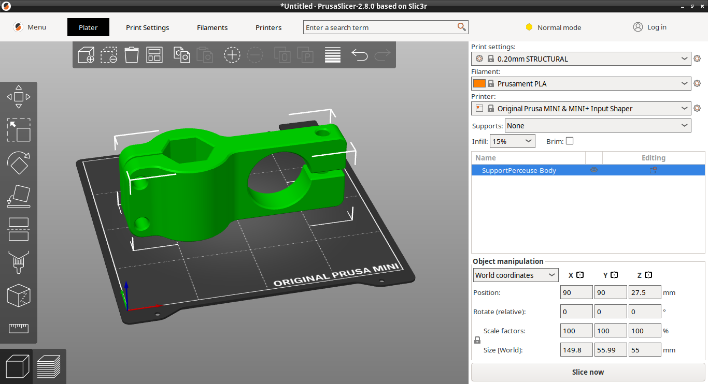

# wabeco

 

## Keywords
wabeco, drilling milling stand, bf1242, 3d print

## Goal

I own this model : [Bohrständer Fräsständer BF1242 (Drilling milling stand)](https://www.wabeco-remscheid.de/bohrstander-zubehor/bohrstander-frasstander-bf/bf1242/bohrstander-frasstander-bf1242.html)
and the original drill holder (aluminium molded) does not fit any of my (cheap) drilling machines.

An engineering response it to draw and print a replacement to go forward !

So it is ! It's a prototype, easy to understand and modify and it's working ...

If you like it, use it, modify it and share it with others.

Be kind, do not blame, if you can do better, do it and share it (with CAD files)

## Howto

### Files

1. The design, as FreeCAD file. (FreeCAD v1.0.0 rc2)
2. The sliced version (Prusa Slicer 2.8.0)

### Procedure

1. (optional) If you need adjustments, edit the design
2. Get the sliced version, here are my parameters :
   - PLA
   - 0.4 nozzle (Prusa Mini Original)
   - 0.20 mm STRUCTURAL (improved precision over speed)
   - 15% infill
   - infill gyroid
   - supports everywhere
  
  Happy printing !
